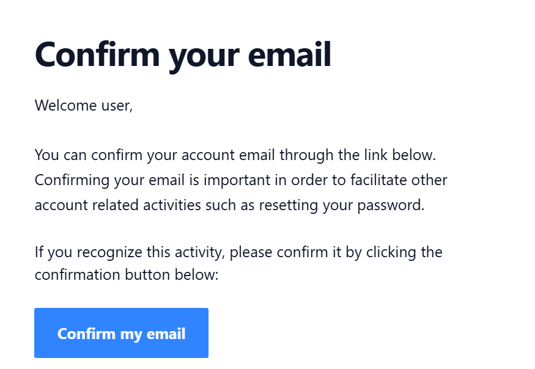

# Creating & linking your Opus Account

=== "New Opus User"

    

    **Follow the steps below to create a new Opus account and complete registration.**

    !!! step

        
        After following the link or scanning the QR code, you will be asked to confirm that you are linking to the correct employee record. Please ensure that your name is displayed on the confirmation page.

        **If your name is not shown**, you may have been provided with an incorrect registration link or QR code. In this case, **do not proceed** and contact the person who provided it to you immediately.

        
        { style="border-radius: 8px" width="400" loading=lazy }
        { style="border-radius: 8px" width="400" loading=lazy }

    !!! step

        
        Click **Sign up**

        
        { style="border-radius: 8px" loading=lazy }
        { style="border-radius: 8px" loading=lazy }

    !!! step

        
        Create your Opus account using an email and password.

        
        { style="border-radius: 8px" width="400" loading=lazy }
        { style="border-radius: 8px" width="400" loading=lazy }

    !!! step

        

        You will now see a Link Confirmation page displaying your name. Click **Link My Opus Account** to continue.

        
        
        

        !!! warning

            

            Don't skip this step! 

            If the employee skips this step, they'll have an Opus account without an associated employee record. See [Incomplete Registration](https://sites.google.com/opus-safety.co.uk/opus-help/employee-users/employee-management/troubleshooting-log-in-registration-problems#:~:text=Locked%20Account-,Incomplete%20Registration%20%2D%20when%20an%20employee%20lands%20on%20a%20page%20that%20says%20%27Cannot%20find%20what%20you%20are%20looking%20for%27,-If%20a%20user) in the Troubleshooting Login / Registration Problems guide.

        !!! note "Registration links are one-time use"

            

            Users should bookmark the Opus system web address or visit [www.opus-safety.co.uk](http://www.opus-safety.co.uk) and click **Log in** at the top right to access the system in future.

    !!! step

        
        After registering, you will receive an email confirmation. Click the **Confirm my email** button in your email.

        
        { style="border-radius: 8px" loading=lazy }

=== "Existing Opus User"

    

    **Follow the steps below to complete registration with an existing Opus account.**

    !!! step

        
        After following the link or scanning the QR code, you will be asked to confirm that you are linking to the correct employee record. Please ensure that your name is displayed on the confirmation page.

        **If your name is not shown**, you may have been provided with an incorrect registration link or QR code. In this case, **do not proceed** and contact the person who provided it to you immediately.

        
        { style="border-radius: 8px" width="400" loading=lazy }
        { style="border-radius: 8px" width="400" loading=lazy }

    !!! step

        

        Click **Sign in**

        
        
        

    !!! step

        

        Sign in with your existing Opus account.

        
        { width="400" loading=lazy }
        { width="400" loading=lazy }

        !!! question "Forgot your password?"

            

            Use the [Forgot your password?](https://cloud.opus-safety.co.uk/users/password/new) link and follow the instructions to reset your password.

    !!! step

        

        You will now see a Link Confirmation page displaying your name. Click **Link My Opus Account** to continue.

        
        
        

        !!! warning

            

            Don't skip this step! 

            If the employee skips this step, they'll have an Opus account without an associated employee record. See [Incomplete Registration](https://sites.google.com/opus-safety.co.uk/opus-help/employee-users/employee-management/troubleshooting-log-in-registration-problems#:~:text=Locked%20Account-,Incomplete%20Registration%20%2D%20when%20an%20employee%20lands%20on%20a%20page%20that%20says%20%27Cannot%20find%20what%20you%20are%20looking%20for%27,-If%20a%20user) in the Troubleshooting Login / Registration Problems guide.

        !!! note "Registration links are one-time use"

            

            Users should bookmark the Opus system web address or visit [www.opus-safety.co.uk](http://www.opus-safety.co.uk) and click **Log in** at the top right to access the system in future.