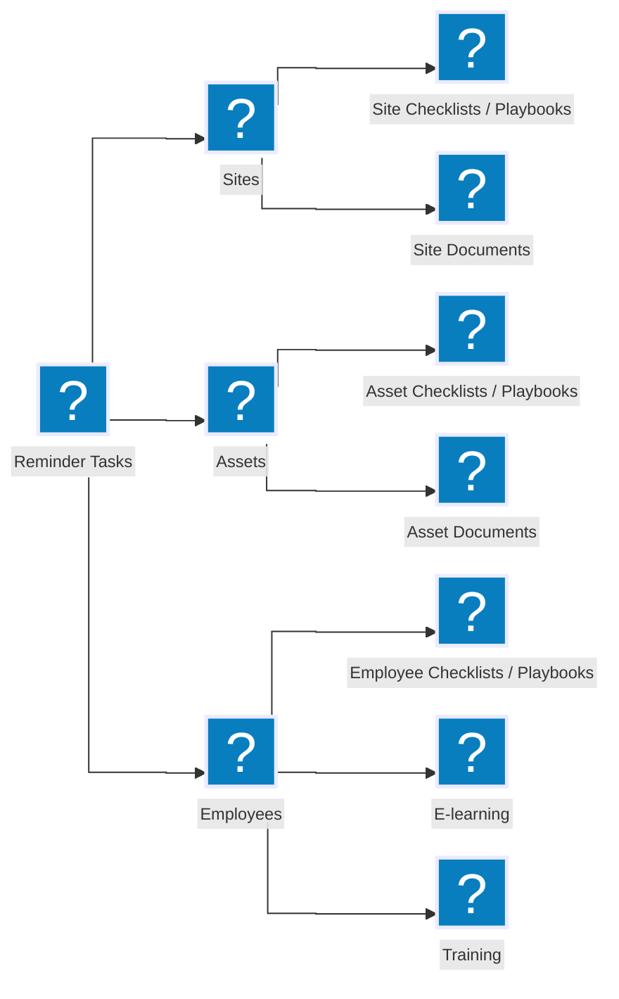

# Types of task

Broadly speaking, tasks can be categorised into different types based on how they are generated and their content.

## Reminder Tasks

```mermaid
%%{init: {'flowchart': {'curve': 'stepBefore', 'nodeSpacing': 20, 'rankSpacing': 45, 'padding': 4}, 'themeVariables': {'fontSize': '12px'}}}%%

graph LR

R@{ icon: "lucide:bell", form: "square", label: "Reminder Tasks", pos: "b" }

R --> S@{ icon: "lucide:building-2", form: "square", label: "Sites", pos: "b" }

R --> A@{ icon: "lucide:truck", form: "square", label: "Assets", pos: "b" }

R --> E@{ icon: "lucide:users", form: "square", label: "Employees", pos: "b" }

S --> S1@{ icon: "lucide:clipboard-check", form: "square", label: "Site Checklists / Playbooks", pos: "b" }

S --> S2@{ icon: "lucide:file-text", form: "square", label: "Site Documents", pos: "b" }

A --> A1@{ icon: "lucide:clipboard-check", form: "square", label: "Asset Checklists / Playbooks", pos: "b" }

A --> A2@{ icon: "lucide:file-text", form: "square", label: "Asset Documents", pos: "b" }

E --> E1@{ icon: "lucide:clipboard-check", form: "square", label: "Employee Checklists / Playbooks", pos: "b" }

E --> E2@{ icon: "lucide:graduation-cap", form: "square", label: "E-learning", pos: "b" }

E --> E3@{ icon: "lucide:book-open", form: "square", label: "Training", pos: "b" }

class R root

class S,A,E branch

class S1,S2,A1,A2,E1,E2,E3 leaf
```