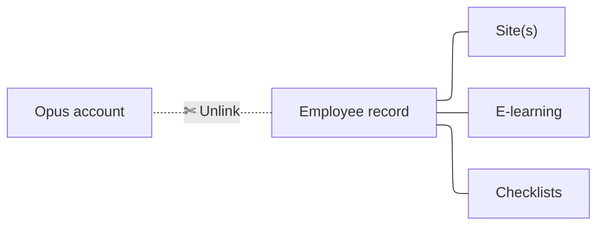

# Unlinking an employee

Sometimes you may need to unlink an employee record from its linked account.

Follow the steps below:

!!! success "Complete!"

    
    The account has now been successfully unlinked from the record. If needed, you can now re-register/link this employee following our **Registering an employee** guide below.

    
    [Registering an employee :lucide-arrow-right:](registering-an-employee.md){ .md-button .custom-button-slate .custom-button--slim }