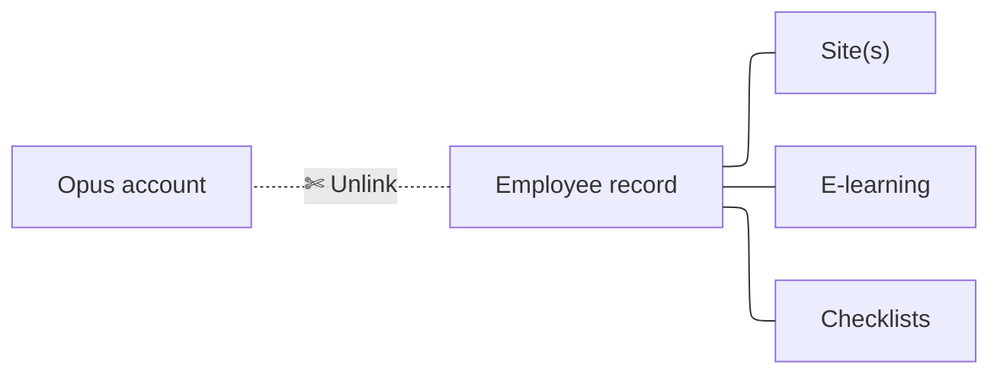

# Unlinking an employee

Sometimes you may need to unlink an employee record from its linked account.

Follow the steps below:

```mermaid
---
config:
  layout: elk
---
flowchart RL
    n3["Site(s)"] --- n2["Employee record"]
    n4["E-learning"] --- n2
    n5["Checklists"] --- n2
    n2 -. ✄ Unlink .- n1["Opus account"]

    n3@{ shape: rect}
    n2@{ shape: rect}
    n4@{ shape: rect}
    n5@{ shape: rect}
    n1@{ shape: rect}
    classDef question stroke:#6b7280,fill:#f3f4f6,stroke-width:2px
    classDef action stroke:#16a34a,fill:#dcfce7,stroke-width:2px
```
