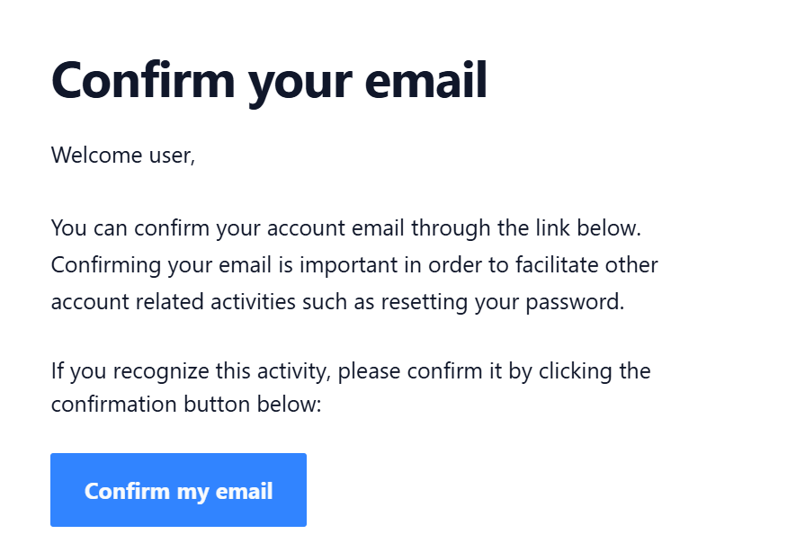

# Registering an Employee with an Opus Account

Follow this guide to register an employee in Opus Compliance Cloud using their own Opus account. **This guide assumes that the employee record already exists.**

??? note "SSO Users Information"

    
    If you are using Single Sign On (SSO), the process is slightly different as users will be using their company credentials to log in. Please refer to the documents > help folder in Site Documents for client specific instructions.

!!! tip "No Account? Try Temporary Access"

    
    Interested in a quick and easy way for employees to complete their personal requirements without creating an account? [Explore our Temporary Access feature](/opus-safety.co.uk/opus-help/employees/employee-management/granting-an-employee-temporary-access) and give them secure, time-limited access to the system.

## Manager Steps

Please follow the steps below to register employees as users on the system.

!!! step

    
    From [My Dashboard](https://cloud.opus-safety.co.uk/dashboard), click on **Pick workspace** and select the site where the employee is located.

    { style="height: 50px" loading=lazy }
    { style="height: 50px" loading=lazy }

!!! step

    
    From the site inbox, click the **Switch to Manage Mode** button.

    { style="height: 50px" loading=lazy }
    { style="height: 50px" loading=lazy }

!!! step

    
    Click **Employee records** on the manage sidebar.

    { style="height: 50px" loading=lazy }
    { style="height: 50px" loading=lazy }

!!! step

    
    In the employee list, click the blue **Link to Opus Account** button next to the employee record.

    
    

!!! step

    
    A QR code page will appear. You can then either:

    1. Ask the employee to scan the QR code with their phone (remind them to log out if they're using someone else's phone).
    2. Copy the link using the button at the bottom and send it via email or an internal messaging system (like Teams or Slack).

    { width="400" loading=lazy }
    { width="400" loading=lazy }

    ??? info "Optional Registration Email Template"

        
        If using the copied link, you can use a message like this to help:

        ---

        Welcome to the Opus Compliance Cloud

        There are two steps to registration:

        **Step 1. Creating your Opus account**

        To get started, please click on your unique registration link below and select 'Sign up' to create your Opus account:

        [registration link]

        **Step 2. Linking your Opus account to your employee record**

        Click 'Link my Opus account' on the following page.

        ---

        Once you've successfully registered, we suggest bookmarking your landing page. Or to access in future, visit [www.opus-safety.co.uk](http://www.opus-safety.co.uk) and select 'Log in' via the menu in the top right corner.

        If you need any assistance, our [Opus Knowledge Base](https://sites.google.com/opus-safety.co.uk/opus-help) is always available — access it by clicking on your profile icon in the top right corner of the system and selecting **Support**.

        We recommend having a look at these articles:

        - [System Overview for Managers](/opus-safety.co.uk/opus-help/introduction/managers-quick-guide) — a quick introduction to the system
        - [Training Videos](/opus-safety.co.uk/opus-help/introduction/training-videos) — a series of 15 short videos that cover the basics
        - [Subscribing to Notifications](/opus-safety.co.uk/opus-help/introduction/subscribing-to-notifications-email-in-system) — remember to subscribe if you want to receive email notifications

        You can also include any additional information or context you think is necessary for your staff — such as company-specific instructions or a personalised message from a senior manager. This can make for a much warmer and more engaging interaction than a generic system email.

---

## User Steps

This section is intended to be followed by the user being registered.

!!! step

    
    After following the link or scanning the QR code, you will be asked to confirm that you are linking to the correct employee record. Please ensure that your name is displayed on the confirmation page.

    **If your name is not shown**, you may have been provided with an incorrect registration link or QR code. In this case, **do not proceed** and contact the person who provided it to you immediately.

    { width="300" loading=lazy }
    { width="300" loading=lazy }

!!! step

    
    Click **Sign up** (use **Sign in** only if the employee already has an Opus account).

    
    

    
    

!!! step

    
    Create your Opus account using an email and password.

    { width="300" loading=lazy }
    { width="300" loading=lazy }

!!! step

    
    You will now see a Link Confirmation page displaying your name. Click **Link My Opus Account** to continue.

    
    

    !!! warning "Don't skip this step"

        
        If the employee skips this step, they'll have an Opus account without an associated employee record. See [Incomplete Registration](https://sites.google.com/opus-safety.co.uk/opus-help/employee-users/employee-management/troubleshooting-log-in-registration-problems#:~:text=Locked%20Account-,Incomplete%20Registration%20%2D%20when%20an%20employee%20lands%20on%20a%20page%20that%20says%20%27Cannot%20find%20what%20you%20are%20looking%20for%27,-If%20a%20user) in the Troubleshooting Login / Registration Problems guide.

    !!! note "Registration links are one-time use"

        
        Users should bookmark the Opus system web address or visit [www.opus-safety.co.uk](http://www.opus-safety.co.uk) and click **Log in** at the top right to access the system in future.

!!! step

    
    After registering, you will receive an email confirmation. Click the **Confirm my email** button in your email.

    