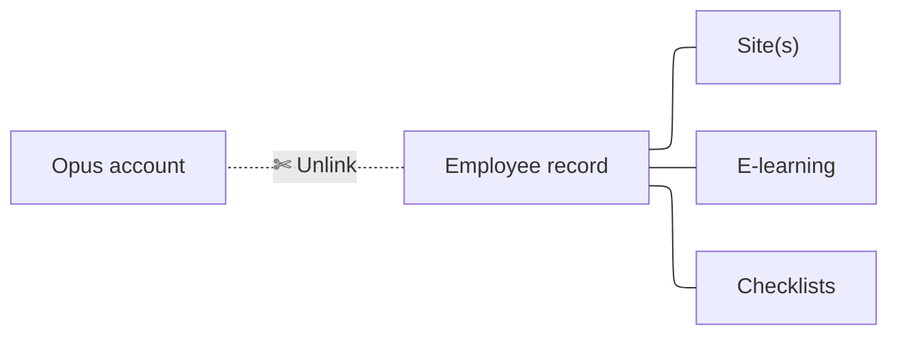

# Unlinking an employee

Sometimes you may need to unlink an employee record from its linked account.

Follow the steps below:

## Steps

!!! step

    

    From [My Dashboard](https://cloud.opus-safety.co.uk/dashboard), click on **Pick workspace** and select the site where the employee is located.

    
    { style="height: 50px" loading=lazy }
    { style="height: 50px" loading=lazy }

!!! step

    

    From the site inbox, click the **Switch to Manage Mode** button.

    
    { style="height: 50px" loading=lazy }
    { style="height: 50px" loading=lazy }

!!! step

    

    Click **Employee records** on the manage sidebar.

    
    { style="height: 50px" loading=lazy }
    { style="height: 50px" loading=lazy }

!!! step

    

    Find the employee from the list and click on their name

    
    { style="border-radius: 8px" loading=lazy }
    { style="border-radius: 8px" loading=lazy }

    !!! tip "Shortcut!(optional)"

        

        If you see the red Remove button next to the employee’s name in the list, you can click this instead to schedule the employee to be archived at the end of the day. You can then skip the remaining steps.

        If you need to set a specific end date for the employee (for example, if their leaving date is in the future or was in the past), continue with the steps below.

!!! step

    

    Click **Unlink user account** on the record

    
    { style="height: 50px" loading=lazy }
    { style="height: 50px" loading=lazy }

!!! step

    

    On the confirmation page, read the information and warnings carefully to ensure you understand the implications of unlinking the record.

    If you’re happy to proceed, select **Confirm unlinking**

    
    { style="height: 50px" loading=lazy }
    { style="height: 50px" loading=lazy }

!!! success "Complete!"

    

    The account has now been successfully unlinked from the record. If needed, you can now re-register/link this employee following our **Registering an employee** guide below.

    
    [Registering an employee :lucide-arrow-right:](registering-an-employee.md){ .md-button .custom-button-slate .custom-button--slim }